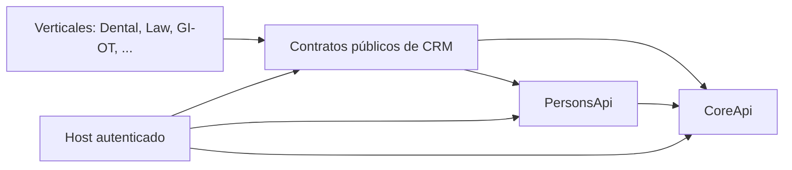

# Arquitectura de GI-COMMON-CRM

Estado: diseño aprobado para la unidad `01-fundacion-diseno`, a implementar
en el Milestone `leads-core-implementation` (02–06). Fuente funcional: GOAL
"GI-COMMON-CRM — Fundación, diseño e implementación" (2026-09-20) y hechos
reales verificados de `gi-platform-core` y `gi-common-persons` — ver
[contexto de producto](../producto/contexto-producto.md) para el resumen
funcional persistente. Este documento razona las decisiones técnicas; no
repite lo ya fijado allí salvo lo necesario para justificar un ADR.

## Límites y dependencias

CRM no importa `gi_platform_core` ni `gi_persons` como dependencia dura:
define sus propios `Protocol` locales (`CoreApi`, `PersonsApi`) que las
implementaciones reales ya satisfacen por forma (duck typing), igual que
Persons hizo con Core. Ningún consumidor de CRM (una vertical) importa las
tablas ni clases privadas de CRM; sólo `gi_crm.api`/`gi_crm.models` públicos
o la API HTTP versionada.

## ADR-C01: identidad y cardinalidad de Lead frente a Person y Organization

Lead es propiedad de una Organization (mismo criterio de tenant que Core y
Persons: `organization_id`, sin un `tenant_id` paralelo). `person_id` en
Lead es **opcional y sin `UNIQUE`**: una persona física puede generar
distintos procesos comerciales en el tiempo, y en distintas
organizaciones/verticales, sin que eso constituya un duplicado. Un Lead
puede existir sin Person identificada (captación incompleta) y vincularse
más tarde.

Alternativa considerada: `UNIQUE(organization_id, person_id)` para forzar
"un lead activo por persona". Se descarta porque el GOAL confirma
explícitamente cardinalidad no única y porque impediría procesos
comerciales legítimos y simultáneos (p. ej. dos consultas distintas de la
misma persona en servicios distintos de la misma organización). La
prevención de duplicados accidentales se resuelve en el *service*
(detección vía `PersonsApi.find_duplicate_candidates` + reglas de negocio
explícitas), no con una restricción física que bloquee casos válidos.

Client/Patient/Professional/Opportunity son conceptos de la vertical, no de
CRM: CRM sólo conserva `LeadExternalReference` (referencia lógica,
`UNIQUE(organization_id, vertical_code, external_type, external_id)`) hacia
la entidad que la vertical cree al convertir el Lead. No hay FK física entre
bases de datos de servicios separados.

## ADR-C02: stack y composición

Paquete `gi_crm`, Python ≥3.12, cero dependencias de runtime obligatorias
(mismo criterio que `gi_platform_core`/`gi_persons`). FastAPI, uvicorn y
psycopg quedan como *extras* opcionales (`gi-common-crm[http]`,
`[postgres]`): la biblioteca (dominio + puertos + fachada) no obliga a
instalar un framework HTTP ni un driver de base de datos a quien sólo
consume `gi_crm.api` en proceso.

Capas: `models` (dataclasses `frozen, slots`) → `ports` (`Protocol` de
dependencias) → `service` (reglas de negocio, máquina de estados) → `api`
(fachada JSON-safe, paginación por cursor) → adaptadores (`memory`,
`dbapi`, `http/`). La lógica de negocio vive en `service.py` y no conoce si
la invoca la biblioteca en proceso o la capa HTTP — ambas modalidades deben
ofrecer equivalencia funcional real, no dos implementaciones paralelas.

Se descarta introducir un framework de aplicación adicional (p. ej. Django)
por no aportar nada sobre el patrón ya validado por Core/Persons y por
imponer dependencias de runtime que el resto del ecosistema evita.

## ADR-C03: autorización, multitenancy y modo fail-safe

Cada operación de `LeadService` llama `CoreApi.authorize(user_id,
organization_id, "crm:lead:<acción>", location_id)` a través del puerto
antes de tocar el store. Sin autorización explícita no hay operación — ni
lectura ni escritura — incluso si Core no está disponible: la
indisponibilidad de una dependencia externa nunca se traduce en "permitir
por defecto" (`CoreUnavailableError`, falla cerrado). El mismo criterio
aplica a `PersonsApi`: si no está disponible, la búsqueda de duplicados y el
vínculo con Person fallan explícitamente; el Lead puede seguir
gestionándose en su ciclo comercial sin bloquear todo el servicio.

El contexto de organización nunca se toma de un parámetro `organization_id`
recibido sin verificar: viaja dentro de `RequestContext(trusted=True)`
suministrado por el host autenticado (mismo contrato que ya usan Core y
Persons), y toda consulta/escritura lo aplica de forma consistente
(filtrado en el store, no sólo en el service). Se añaden pruebas negativas
de aislamiento cruzado (una organización no puede ver ni afectar Leads,
actividades, historial o candidatos a duplicado de otra) como parte
obligatoria del Milestone 02-06, no como mejora posterior.

## ADR-C04: persistencia — PostgreSQL sin ORM, esquema `crm`

Se seguirá la convención real ya establecida por Persons (no la sugerencia
genérica de Alembic del GOAL, descartada por no encajar con el ecosistema
existente): SQL versionado a mano en `supabase/migrations/`, esquema propio
`crm.*`, PK compuesta `(organization_id, id)`, Row-Level Security por
`current_setting('app.organization_id', true)`, triggers de `updated_at` y
de auditoría append-only, adaptador `PostgresLeadStore` DB-API 2.0 puro que
no importa `psycopg` directamente (el host inyecta la fábrica de
conexión). Motivo: consistencia entre servicios COMMON del Sistema
Integral GI y reducción de superficie de dependencias nuevas.

Las pruebas reales de este adaptador corren contra un Postgres efímero
(contenedor Docker local; servicio de Postgres en GitHub Actions) — nunca
contra el proyecto Supabase compartido (`gletzbwuvmwjkmoufmyj`) que hoy
usan Core y Persons en producción. Desplegar la migración `crm.*` ahí es la
unidad `08-persistencia-supabase-real`, explícitamente diferida y
condicionada a autorización humana previa por tratarse de infraestructura
ajena en uso.

## ADR-C05: modalidad HTTP — contrato documentado, integración bloqueada

Tanto `gi-platform-core` (`v0.1.0`) como `gi-common-persons` (milestone
02-07 en `develop`, sin release) exponen **sólo biblioteca Python** hoy; no
hay servicio HTTP desplegado para ninguno de los dos. CRM define de todas
formas sus adaptadores `adapters/core_http.py` y `adapters/persons_http.py`
contra un contrato HTTP documentado (mismo *shape* JSON que las fachadas
reales), para no bloquear el diseño de puertos, pero estos adaptadores se
prueban únicamente contra un servidor HTTP simulado en tests — se
documentan explícitamente como **no verificables end-to-end** hasta que
Core y/o Persons publiquen un servicio HTTP real. No se declara esta
integración como probada mientras dependa de un simulador.

Para su propia superficie pública, CRM sí expone HTTP real (FastAPI +
OpenAPI) desde el Milestone 02-06, con el mismo contexto de tenant
(`RequestContext(trusted=True)`) recibido por cabeceras confiables
inyectadas por el host/proxy autenticado — dependencia de un servicio de
identidad HTTP real de Core que hoy tampoco existe, y que se documenta
igual que hizo Persons para su propio caso.

## ADR-C06: ciclo de vida comercial del Lead

Estados mínimos con transición validada en `LeadService` (no en la base de
datos): `new → contacted → qualified → in_progress → (won | lost)`, más
`archived` desde cualquier estado no terminal. Cada cambio de estado
genera un `LeadStatusEvent` append-only (historial, nunca se sobrescribe).
Concurrencia optimista vía `version`/`expected_version`, igual criterio que
`gi_persons.Person`, para evitar condiciones de carrera en asignaciones o
cambios de estado concurrentes sobre el mismo Lead.

Se descarta modelar la máquina de estados como una tabla de transiciones
en SQL (con `CHECK` constraints por transición): la lógica de negocio
(quién puede transicionar, qué motivo de cierre es válido) puede evolucionar
más rápido que el esquema y pertenece al dominio, no a la integridad
referencial de la base.

## Exclusiones iniciales

Sin UI gráfica, sin campañas ni marketing automatizado, sin oportunidades
avanzadas más allá del Lead, sin integración HTTP real con Core/Persons
(bloqueada del lado de esos repos), sin despliegue a la infraestructura
Supabase compartida (unidad tardía, condicionada a autorización humana).
Cada exclusión delimita esta primera fundación e implementación; no
elimina un requisito futuro del producto.
